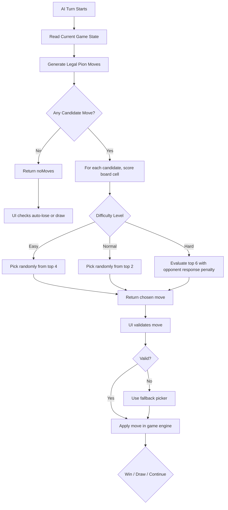
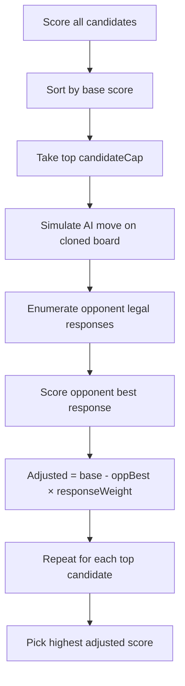

# AI Implementation Details

This document explains how AI works in production for both games.

- `AI` = Addition game (`js/ai.js`)
- `AIMult` = Multiplication game (`js/ai-perkalian.js`)

They are **not totally different** architectures. They share the same decision pipeline and difficulty model, but differ in move-space constraints (sum cap vs product domain, 10 cols vs 9 cols).

---

## AI Flowchart (User-Friendly)

Use this section for quick understanding before diving into technical detail.



### Addition vs Multiplication in the flow

- **Addition path** computes `sum` and ignores moves where `sum > 18`.
- **Multiplication path** computes `product` with 9 columns (1–9) and no sum-cap filtering.
- Everything else in the decision pipeline is the same.

---

## 1) Runtime Ownership and Flow

AI always plays as **Player 2 / Red / index `1`**.

Main call sites:

- Addition:
  - `UI.doAITurn()` in `js/ui.js`
  - `UI.doAIPlacement()` in `js/ui.js`
  - `UI.doAIFirstPlacement()` in `js/ui.js`
- Multiplication:
  - `UIMult.doAITurn()` in `js/ui-perkalian.js`
  - `UIMult.doAIPlacement()` in `js/ui-perkalian.js`
  - `UIMult.doAIFirstPlacement()` in `js/ui-perkalian.js`

Execution pattern:

1. UI asks AI for move/placement.
2. UI validates AI output (shape + legality against current available cells).
3. If invalid/throws, UI falls back to deterministic local fallback chooser.
4. UI applies move through game logic module (`Game`/`GameMult`) and resolves win/auto-lose/draw.

This defensive wrapper prevents hard failures from crashing gameplay.

---

## 2) Shared Decision Pipeline (Both Games)

For normal AI turns (`chooseMove`):

1. Read state (`Game.getState()` / `GameMult.getState()`).
2. Enumerate legal pion columns (must move, so current column is skipped).
3. Compute target number from moved pion + opponent pion:
	- Addition: `sum = (humanPos + 1) + (aiPos + 1)`
	- Multiplication: `product = (humanPos + 1) * (aiPos + 1)`
4. Collect matching unclaimed board cells for that value.
5. Score every candidate `(pionCol, boardRow, boardCol)` with `evaluateMove`.
6. Choose final action based on profile:
	- Easy/Normal: random pick among top-N.
	- Hard: depth-2 style response penalty on top candidates, then pick best.

If no candidates exist, AI returns `{ noMoves: true, pionCol: nextColumn, boardRow: -1, boardCol: -1 }` and UI resolves auto-lose/draw rules.

---

## 3) Heuristic Function (`evaluateMove`)

Both modules use the same scoring structure:

1. **Immediate win check** via virtual win detector:
	- If true, return `winScore` immediately.
2. **Immediate block check**:
	- If opponent would win on this cell, add `blockWinBonus`.
3. **Self streak pressure**:
	- Count contiguous owned cells in 4 directions and add tiered streak weights.
4. **Opponent disruption value**:
	- Count opponent contiguous cells and add tiered opponent streak weights.
5. **Center preference**:
	- `centerDist = |row - 4.5| + |col - 4.5|`
	- Add `max(0, 10 - centerDist) * centerWeight`.
6. **Noise/randomness**:
	- Add `Math.random() * randomBonus`.

Direction set used by win/streak logic: horizontal, vertical, diagonal down-right, diagonal down-left.

---

## 4) Difficulty Profiles (Exact Values)

Current profiles are identical between `AI` and `AIMult`.

| Parameter | Easy | Normal | Hard |
|---|---:|---:|---:|
| `winScore` | 100000 | 100000 | 100000 |
| `blockWinBonus` | 28000 | 50000 | 52000 |
| `selfStreak3` | 2200 | 5000 | 5500 |
| `selfStreak2` | 220 | 500 | 560 |
| `selfStreak1` | 28 | 50 | 55 |
| `oppStreak3` | 2600 | 8000 | 9000 |
| `oppStreak2` | 140 | 300 | 360 |
| `oppStreak1` | 14 | 20 | 26 |
| `centerWeight` | 2.2 | 5 | 5.5 |
| `randomBonus` | 42 | 10 | 3 |
| `lookaheadDepth` | 0 | 0 | 2 |
| `candidateCap` | 8 | 10 | 6 |
| `responseWeight` | 0 | 0 | 0.75 |
| `topPickCount` | 4 | 2 | 1 |
| `openingCenterWeight` | 1.3 | 2.4 | 3 |
| `openingRandomBonus` | 20 | 8 | 2 |
| `placementRandomChance` | 0.65 | 0.3 | 0.08 |

Interpretation:

- Easy = high exploration/randomness, weaker tactical pressure.
- Normal = tactical baseline.
- Hard = tactical baseline + opponent-response penalty with low randomness.

---

## 5) Hard Mode Lookahead (Depth-2 Style)

### Hard Mode Mini Flowchart



Enabled when `lookaheadDepth >= 2` (Hard only):

1. Sort all candidates by base score.
2. Keep top `candidateCap`.
3. For each candidate, simulate AI placing on board clone.
4. Enumerate opponent legal pion moves from that simulated state.
5. Score opponent responses with same evaluator.
6. Compute adjusted score:

```text
adjusted = baseScore - (opponentBestResponse * responseWeight)
```

7. Pick highest adjusted candidate.

This is a single-ply best-response penalty (not full minimax tree), chosen for speed and stability.

---

## 6) Opening Behavior

### 6.1 Initial side-board placement (`chooseInitialPlacement`)

Both modules use center-first preferred order + probabilistic randomness.

- Addition preferred columns: `[4, 5, 3, 6, 2, 7, 1, 8, 0, 9]`
- Multiplication preferred columns: `[4, 3, 5, 2, 6, 1, 7, 0, 8]`

When placing the second pion:

- Addition filters with `Game.getDisabledColumnsForPlacement(firstPionCol)` (sum cap ≤ 18).
- Multiplication has no value-range placement restriction (`[]`), but code path remains symmetric.

Random opening behavior by level uses `placementRandomChance` over first few preferred choices.

### 6.2 First board placement after setup (`chooseFirstBoardPlacement`)

For each available board cell:

```text
openingScore = tacticalScore
				 + centerBonus(openingCenterWeight)
				 + random(openingRandomBonus)
```

Then pick randomly from top `topPickCount` scored cells.

---

## 7) Game-Specific Differences

## Addition (`js/ai.js` + `js/game.js`)

- Side-board columns: `0..9` (values 1..10).
- Candidate value is `sum`.
- Any move where `sum > 18` is ignored by AI and disabled by rules.
- Placement constraints for second pion exist due sum cap.

## Multiplication (`js/ai-perkalian.js` + `js/game-perkalian.js`)

- Side-board columns: `0..8` (values 1..9).
- Candidate value is `product`.
- No value-range disable rule (all products from side board are valid targets).
- Placement constraint helper returns empty list.

Result: same algorithm shape, different legal-move geometry.

---

## 8) UI Safety Nets and Fallbacks

UI guards exist in both game UIs:

- AI calls are wrapped in `try/catch`.
- Returned board cell is validated against current `availableCells`.
- Invalid decisions trigger fallback choosers:
  - fallback move picker
  - fallback initial placement picker
  - fallback first board placement picker

Fallback strategy is intentionally simpler (center-biased + small randomness) and ensures game continuity.

---

## 9) Performance Characteristics

- Candidate enumeration worst-case is bounded by side-board width × matching cells.
- Hard lookahead only evaluates top `candidateCap`, limiting response explosion.
- No recursion/minimax tree; evaluation is iterative and fast enough for UI delay-based turns.

---

## 10) Change Checklist (When Editing AI)

When adjusting weights/logic, verify both games:

1. AI always takes immediate win if available.
2. AI blocks immediate loss when block exists.
3. AI never returns illegal pion column.
4. AI never returns occupied/non-matching board cell after UI validation path.
5. No-move path still resolves correctly to auto-lose or draw.
6. Easy/Normal/Hard feel distinct (randomness and consistency).
7. Turn latency remains acceptable, especially Hard mode.

---

## 11) Source Map

- `js/ai.js` (Addition AI core)
- `js/ai-perkalian.js` (Multiplication AI core)
- `js/game.js` (Addition legal-move constraints and outcomes)
- `js/game-perkalian.js` (Multiplication legal-move constraints and outcomes)
- `js/ui.js` (Addition AI integration + fallbacks)
- `js/ui-perkalian.js` (Multiplication AI integration + fallbacks)
